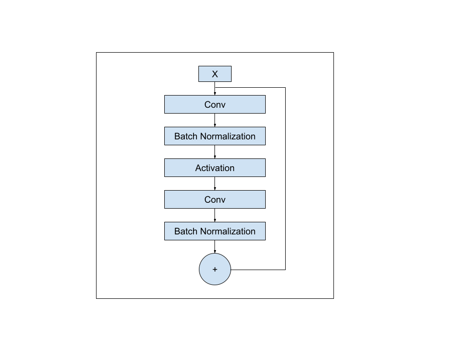

# Compressing neural networks for use in FPGAs

## Introduction

Artificial neural networks (ANNs) are being deployed to solve difficult real-world problems, including object identification in images and video, voice recognition, and autonomous driving. The problem with typical ANNs is that they require a lot of computational power to run, limiting their deployment to systems that can host power-hungry graphic processing units (GPUs). Field programmable gate arrays (FPGAs) could be used as an alternative to GPUs for running ANNs with lower power requirements, but FPGAs tend to be resource constrained, making it difficult to port ANNs to them. One solution to this problem is improving neural network compression techniques to help downsize larger neural networks to fit into FPGAs.

This project explores the use of a specific algorithm to help compress residual neural networks (ResNets). Specifically, ResNets have skip connections between their layers which improve the network's capacity to converge on a solution, but adds complexity to FPGA implementations. Prior work done at UC San Diego began to explore the effects of removing skip connections and quantization of network weights on classification accuracy. We build off that work and evaluate the impact on classification accuracy of a special application of knowledge distillation to train ResNets with skip connections removed iteratively, and of quantizing the network with different parameters.

Our implementation leverages Keras and QKeras to implement the neural networks and related training routines, and hls4ml and Vivado HLS to convert ResNets and their skip-less variants to FPGA bitstreams. We trained our networks using the CIFAR10 dataset. Our initial results indicate that there is little to no difference between the iterative approach for removing skips versus training the skip-less network normally. We hypothesize that this difference in results is due to a limitation in Keras, specifically of Tensorflow, that prevented us from implementing the iterative approach in a single training pass, as was the case for prior work. We suspect that prior work might have relied in the optimizer state adjusting to the skips being iteratively removed mid-training in order to achieve better results that we have. Nonetheless, we demonstrate that knowledge distillation approaches yield better Top 1 classification accuracy compared to regular training for larger ResNets on CIFAR10.

## Team

 - Doheon Lee - Senior undergraduate student
 - Gabriel Marcano - PhD student

This project was performed for CSE 145/237D under the direction of Ryan Kastner, PhD., and in collaboration with Olivia Weng and Alireza Khodamoradi.

## Layout

This repository contains artifacts related to the project and presentations. Contact Gabriel Marcano via gmarcano@ucsd.edu to gain access to the code repository. For those people with access, the code can be found on [GitLab here](https://gitlab.com/gemarcano/fpga_skip_hls) and it is mirrored on [Github here](https://github.com/gemarcano/fpga_resnet_skip).

The `Documents` folder contains all of the reports made for the project. The project specification outlines the initial idea of the project, which evolved as we gained a better understanding over machine learning and as we implemented the iterative skip removal algorithm for compressing ResNets. The second document, the milestone document, outlines the updated goals for our project. The final report will be placed here when completed, and will contain a summary of all of our work this quarter, our results, and discussions about why our data disagrees with prior work, as well as possible remedies and work to continue.

The `Presentations` folder contains all of the presentations made for the project, along with our speaker notes. The project overview presentation was prepared at the beginning of the quarter and was meant to be a pitch motivating our project. The mid quarter presentation shows the initial work and results as of the middle of the academic quarter. The final presentation and video will be posted here once they are completed.

## Additional details

The following figure is a sketch showing a skip or residual connection skipping over some of the network's layers and recombining with the output of the layers.

ResNets consist of many of these blocks connected in sequence. For example, ResNet20 contains 9 skip connections, while ResNet110 contains 54.

Per the original paper describing ResNets [1], residual connections serve to help deep networks converge to a solution. As skip connections are removed, training the modified ResNets yields lower Top 1 classification accuracy. From our experiments, the deeper the ResNet is, the worse the drop in the Top 1 classification accuracy.

Knowledge distillation is an approach to training neural networks that uses a teacher network to instruct a student model how to act [2]. The teacher model is static and does not change, while the student model updates its weights as the training progresses in an attempt to match the output of the teacher. From our data, smaller ResNets with all skip connections removed trained via knowledge distillation have similar Top 1 accuracy as the same network trained normally, but for much larger networks, like ResNet110, the knowledge distillation approach yields significantly better inaccuracies compared to training the network normally. Refer to our final report for more details.

We are using the Keras framework, on top of Tensorflow, to implement our ResNets, as it is possible to use HLS4ML to convert these models to FPGA bitstreams.

## Future work

All of our work was done with the CIFAR10 dataset, so our results would have to be verified against other datasets to ensure that they are generalizable. As our work and prior work disagree about the efficacy of the iterative skip removal approach, we need to perform more experimentation and analysis to understand what factors lead to this difference.

## References, and additional resources

We used the following resources and papers to learn about neural networks and FPGAs:

 1. "Deep Residual Learning for Image Recognition", by He, et al.
 2. "Distilling the Knowledge in a Neural Network", by Hinton, et al.
 3. https://keras.io/examples/vision/knowledge\_distillation/
 4. https://pp4fpgas.readthedocs.io/en/latest/
 5. "Deep Learning with Python", by François Chollet
